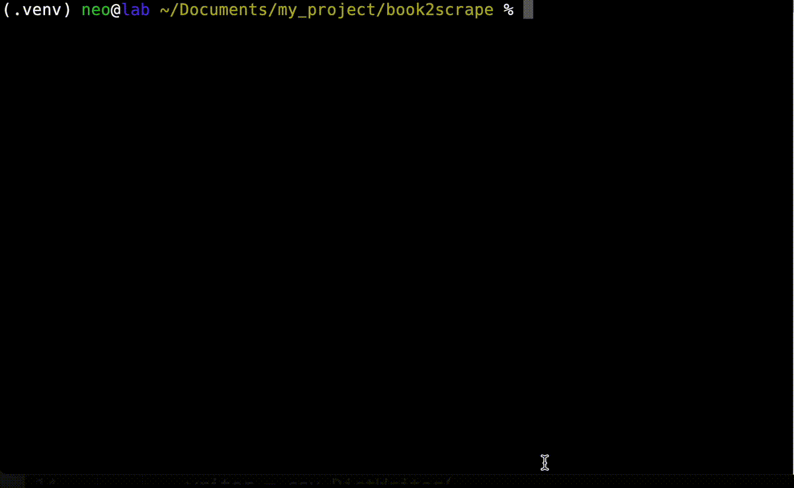
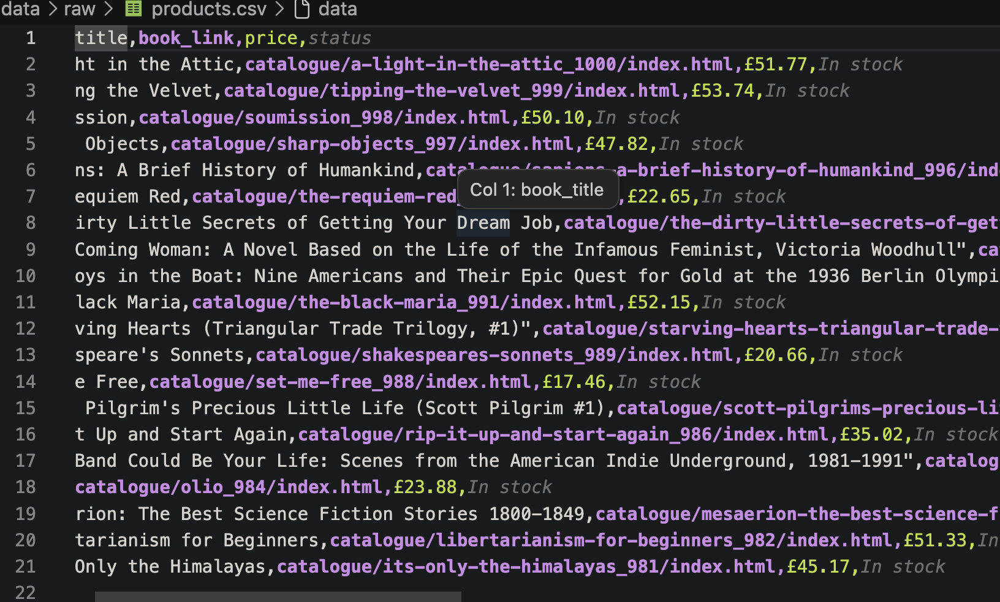
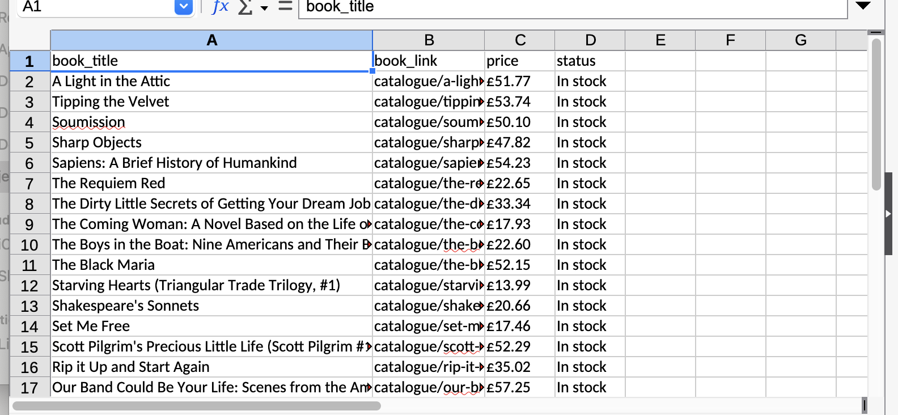

# Static Website Scraper

This is a beginner-friendly learning project created to practice:
- HTTP requests
- HTML parsing
- Data extraction
- CSV exporting

## Preview

### Using


### Output file
CSV File


Excel File


## Learning Goals

- Understand BeautifulSoup parsing
- Practice clean project structure
- Learn CSV export workflow

## Challenges

- Extracting nested HTML elements
- Separating functions for better maintainability and scalability
- Organizing a scalable project structure

## Usage

```bash
python main.py --[OPTION]
```

## Tech Stack
- Python
- Requests
- BeautifulSoup4
- pandas
- openpyxl

## Future Improvements

- Export to Excel
- Add pagination support
- Improve error handling
- CLI control